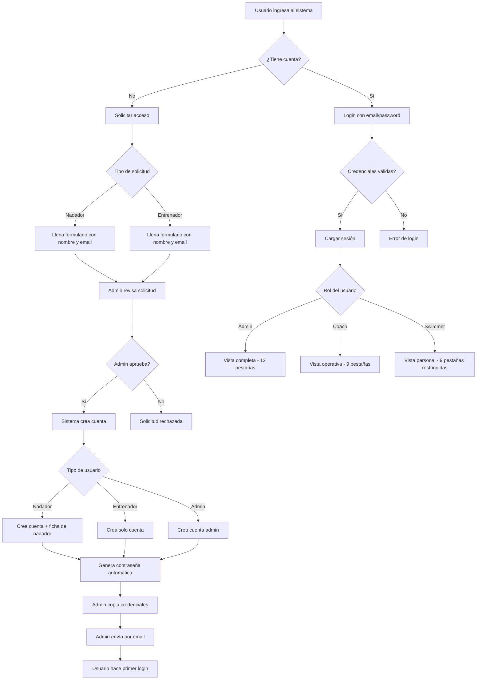

# 📊 Análisis de Perfiles de Usuarios - Club Natación Lo Prado

> **Fecha de análisis:** 8 de Marzo de 2026  
> **Sistema:** Club Natación Lo Prado - Gestión de Entrenamientos  
> **Versión:** 2.0.4

---

## 🎯 Resumen Ejecutivo

El sistema cuenta con **3 roles diferenciados** con permisos y funcionalidades específicas:
- **👨‍💼 Administrador (admin)** - Control total del sistema
- **👨‍🏫 Entrenador (coach)** - Gestión de entrenamientos y nadadores
- **🏊‍♂️ Nadador (swimmer)** - Visualización y seguimiento personal

---

## 1️⃣ PERFIL: ADMINISTRADOR (admin)

### 🔑 Características Principales
- **Acceso:** Acceso completo a todas las funcionalidades del sistema
- **Rol en el sistema:** Superusuario con permisos administrativos totales
- **Interfaz:** Ve todas las 6 pestañas principales + 3 pestañas exclusivas

### 📱 Pestañas Disponibles (12 total)

#### **Pestañas Principales (6)**
1. **🏋️ Entrenamientos** - Gestión completa
2. **💪 Prep. Física** - Gestión de preparación física
3. **📅 Calendario** - Vista integrada de temporada
4. **👥 Nadadores** - Gestión completa de nadadores
5. **🏆 Competencias** - Gestión de competencias
6. **📊 Análisis** - Estadísticas y asistencia

#### **Pestañas Exclusivas del Admin (3)**
7. **🛡️ Usuarios** - Gestión de cuentas de usuario
8. **✅ Solicitudes** - Aprobación de accesos
9. **🗑️ Papelera** - Recuperación de datos eliminados

### ✅ Funcionalidades Específicas

#### **Gestión de Entrenamientos**
- ✅ **Crear** entrenamientos para Grupo 1 (Menores) y Grupo 2 (Mayores)
- ✅ **Editar** cualquier entrenamiento existente
- ✅ **Eliminar** entrenamientos (van a papelera)
- ✅ **Importar** entrenamientos masivos del Grupo 2
- ✅ **Asignar** bloques de entrenamiento (Bloque 1-10)
- ✅ **Configurar** mesociclos y volumen de entrenamiento
- ✅ **Generar PDF** de entrenamientos individuales
- ✅ Ver estructura completa de la temporada 2026-2027

#### **Gestión de Nadadores**
- ✅ **Agregar** nuevos nadadores al sistema
- ✅ **Editar** información completa de nadadores
- ✅ **Eliminar** nadadores (soft delete - papelera)
- ✅ **Asignar** categorías y grupos de entrenamiento
- ✅ **Gestionar** marcas personales y récords
- ✅ **Ver** estadísticas detalladas de cada nadador
- ✅ **Generar PDF** con fichas completas de nadadores
- ✅ **Verificar** tiempos mínimos para competencias
- ✅ Ver tabla de referencia de tiempos mínimos

#### **Gestión de Competencias**
- ✅ **Crear** competencias (Local, Regional, Nacional, Internacional)
- ✅ **Editar** información de competencias
- ✅ **Eliminar** competencias
- ✅ **Asignar** nadadores a competencias
- ✅ **Registrar** resultados de competencias
- ✅ Ver resultados de todos los nadadores
- ✅ Configurar pruebas y categorías

#### **Gestión de Asistencia**
- ✅ **Registrar** asistencia de nadadores
- ✅ **Modificar** registros de asistencia
- ✅ **Ver** análisis avanzado de asistencia
- ✅ **Generar** alertas proactivas de inasistencia
- ✅ Ver estadísticas por nadador y período

#### **Gestión de Usuarios** (EXCLUSIVO)
- ✅ **Crear** cuentas de administradores, entrenadores y nadadores
- ✅ **Editar** información de usuarios
- ✅ **Eliminar** usuarios del sistema
- ✅ **Asignar** roles (admin/coach/swimmer)
- ✅ **Generar** contraseñas seguras automáticas
- ✅ **Vincular** usuarios con fichas de nadadores
- ✅ Ver listado completo de usuarios registrados

#### **Gestión de Solicitudes de Acceso** (EXCLUSIVO)
- ✅ **Ver** solicitudes pendientes de nadadores y entrenadores
- ✅ **Aprobar** solicitudes y crear cuentas automáticamente
- ✅ **Rechazar** solicitudes con justificación
- ✅ **Generar** contraseñas para nuevos usuarios
- ✅ **Copiar** credenciales para enviar por email
- ✅ Ver historial de solicitudes aprobadas/rechazadas

#### **Papelera de Recuperación** (EXCLUSIVO)
- ✅ **Ver** todos los elementos eliminados
- ✅ **Restaurar** nadadores eliminados
- ✅ **Restaurar** entrenamientos eliminados
- ✅ **Restaurar** competencias eliminadas
- ✅ **Eliminar permanentemente** elementos de la papelera
- ✅ Ver fecha de eliminación y detalles

#### **Análisis y Estadísticas**
- ✅ Ver gráficos de volumen de entrenamiento por bloque
- ✅ Ver estadísticas de asistencia general
- ✅ Ver récords del equipo
- ✅ Ver logros y medallas
- ✅ Acceder a todos los reportes del sistema

#### **Preparación Física**
- ✅ **Gestionar** tests de control físico
- ✅ **Registrar** resultados de tests
- ✅ **Analizar** progresión física de nadadores
- ✅ Ver comparativas de rendimiento

### 🎨 Elementos Visuales Distintivos
- **Pestañas adicionales:** Ve 12 pestañas vs 9 de coach/swimmer
- **Botones de acción:** Acceso a todos los botones de Agregar/Editar/Eliminar
- **Panel de solicitudes:** Notificaciones de solicitudes pendientes
- **Menú de usuario:** Opciones de gestión avanzada

---

## 2️⃣ PERFIL: ENTRENADOR (coach)

### 🔑 Características Principales
- **Acceso:** Permisos de gestión operativa (entrenamientos, nadadores, competencias)
- **Rol en el sistema:** Gestor de contenido deportivo
- **Interfaz:** Ve 9 pestañas principales (sin pestañas admin)

### 📱 Pestañas Disponibles (9 total)

1. **🏋️ Entrenamientos** - Gestión completa
2. **💪 Prep. Física** - Gestión de preparación física
3. **📅 Calendario** - Vista integrada de temporada
4. **👥 Nadadores** - Gestión completa de nadadores
5. **🏆 Competencias** - Gestión de competencias
6. **📊 Análisis** - Estadísticas y asistencia
7. **🏅 Récords** - Récords del equipo
8. **🎖️ Logros** - Logros y medallas
9. **📋 Asistencia** - Control de asistencia

### ✅ Funcionalidades Específicas

#### **Gestión de Entrenamientos** (IGUAL que Admin)
- ✅ **Crear** entrenamientos para Grupo 1 y Grupo 2
- ✅ **Editar** cualquier entrenamiento
- ✅ **Eliminar** entrenamientos
- ✅ **Importar** entrenamientos del Grupo 2
- ✅ **Asignar** bloques y mesociclos
- ✅ **Generar PDF** de entrenamientos
- ✅ Ver estructura de temporada completa

#### **Gestión de Nadadores** (IGUAL que Admin)
- ✅ **Agregar** nuevos nadadores
- ✅ **Editar** información de nadadores
- ✅ **Eliminar** nadadores (a papelera)
- ✅ **Gestionar** marcas personales
- ✅ **Ver** estadísticas detalladas
- ✅ **Generar PDF** de fichas
- ✅ **Verificar** tiempos mínimos
- ✅ Ver tabla de referencia de tiempos

#### **Gestión de Competencias** (IGUAL que Admin)
- ✅ **Crear** competencias
- ✅ **Editar** información
- ✅ **Eliminar** competencias
- ✅ **Asignar** nadadores
- ✅ **Registrar** resultados
- ✅ Ver resultados de todos

#### **Gestión de Asistencia** (IGUAL que Admin)
- ✅ **Registrar** asistencia
- ✅ **Modificar** registros
- ✅ **Ver** análisis avanzado
- ✅ **Generar** alertas
- ✅ Ver estadísticas completas

#### **Preparación Física** (IGUAL que Admin)
- ✅ **Gestionar** tests de control
- ✅ **Registrar** resultados
- ✅ **Analizar** progresión
- ✅ Ver comparativas

### ❌ Funcionalidades NO Disponibles

#### **Gestión de Usuarios**
- ❌ NO puede crear cuentas de usuario
- ❌ NO puede editar usuarios existentes
- ❌ NO puede asignar roles
- ❌ NO puede eliminar usuarios

#### **Gestión de Solicitudes**
- ❌ NO puede aprobar solicitudes de acceso
- ❌ NO puede rechazar solicitudes
- ❌ NO ve el panel de solicitudes pendientes

#### **Papelera**
- ❌ NO puede acceder a la papelera
- ❌ NO puede restaurar elementos eliminados
- ❌ NO puede eliminar permanentemente

### 🎨 Elementos Visuales Distintivos
- **Pestañas:** Ve 9 pestañas (sin Usuarios/Solicitudes/Papelera)
- **Botones de acción:** Igual que admin en secciones operativas
- **Sin panel admin:** No ve notificaciones de solicitudes

---

## 3️⃣ PERFIL: NADADOR (swimmer)

### 🔑 Características Principales
- **Acceso:** Solo lectura y gestión personal
- **Rol en el sistema:** Usuario final con vista personalizada
- **Interfaz:** Ve 9 pestañas (mismas que coach pero CON RESTRICCIONES)

### 📱 Pestañas Disponibles (9 total)

1. **🏋️ Entrenamientos** - Solo lectura
2. **💪 Prep. Física** - Solo lectura
3. **📅 Calendario** - Solo lectura
4. **👥 Nadadores** - Vista limitada
5. **🏆 Competencias** - Gestión personal
6. **📊 Análisis** - Vista personal
7. **🏅 Récords** - Vista de récords
8. **🎖️ Logros** - Vista de logros
9. **📋 Asistencia** - Vista personal

### ✅ Funcionalidades Específicas

#### **Visualización de Entrenamientos**
- ✅ **Ver** entrenamientos de su grupo (Grupo 1 o Grupo 2)
- ✅ **Filtrar** por bloque/mesociclo
- ✅ **Ver** detalles completos (calentamiento, series, enfriamiento)
- ✅ **Ver** estructura de la temporada
- ✅ **Descargar PDF** de entrenamientos individuales
- ❌ NO puede crear entrenamientos
- ❌ NO puede editar entrenamientos
- ❌ NO puede eliminar entrenamientos

#### **Visualización de Nadadores**
- ✅ **Ver** su propia ficha completa
- ✅ **Ver** lista de otros nadadores (información básica)
- ✅ **Ver** récords del equipo
- ✅ **Ver** estadísticas generales
- ❌ NO puede agregar nadadores
- ❌ NO puede editar otros nadadores
- ❌ NO puede eliminar nadadores
- ❌ NO puede editar marcas personales de otros

#### **Gestión Personal de Competencias**
- ✅ **Ver** sus competencias asignadas
- ✅ **Registrar** sus propios resultados
- ✅ **Editar** sus propios tiempos y posiciones
- ✅ **Ver** su historial de competencias
- ✅ **Ver** progresión de marcas personales
- ❌ NO puede crear competencias
- ❌ NO puede editar información de competencias
- ❌ NO puede eliminar competencias
- ❌ NO puede asignar nadadores a competencias
- ❌ NO puede ver/editar resultados de otros nadadores

#### **Visualización de Análisis**
- ✅ **Ver** sus propias estadísticas de asistencia
- ✅ **Ver** su progresión de rendimiento
- ✅ **Ver** récords del equipo
- ✅ **Ver** logros personales
- ❌ NO puede ver estadísticas de otros nadadores
- ❌ NO puede modificar registros de asistencia

#### **Preparación Física**
- ✅ **Ver** tests de control asignados
- ✅ **Ver** sus propios resultados de tests
- ✅ **Ver** su progresión física
- ❌ NO puede crear tests
- ❌ NO puede editar tests
- ❌ NO puede eliminar resultados

### ❌ Funcionalidades NO Disponibles

#### **Gestión de Datos**
- ❌ NO puede crear ningún tipo de contenido
- ❌ NO puede editar información del sistema
- ❌ NO puede eliminar nada
- ❌ NO puede asignar nadadores a competencias

#### **Gestión de Asistencia**
- ❌ NO puede registrar asistencia de otros
- ❌ NO puede modificar registros de asistencia

#### **Funciones Administrativas**
- ❌ NO puede acceder a gestión de usuarios
- ❌ NO puede aprobar solicitudes
- ❌ NO puede acceder a la papelera
- ❌ NO puede generar reportes globales

### 🎨 Elementos Visuales Distintivos
- **Vista "Mis Competencias":** En lugar de "Resultados de Competencias"
- **Sin botones de acción:** No ve botones de Agregar/Editar/Eliminar
- **Vista filtrada:** Solo ve información relevante para él
- **Formularios limitados:** Solo puede editar sus propios datos

---

## 📊 Comparativa de Permisos

| Funcionalidad | Admin | Coach | Nadador |
|--------------|-------|-------|---------|
| **ENTRENAMIENTOS** |
| Ver entrenamientos | ✅ | ✅ | ✅ |
| Crear entrenamientos | ✅ | ✅ | ❌ |
| Editar entrenamientos | ✅ | ✅ | ❌ |
| Eliminar entrenamientos | ✅ | ✅ | ❌ |
| Descargar PDF | ✅ | ✅ | ✅ |
| **NADADORES** |
| Ver lista de nadadores | ✅ | ✅ | ✅ (limitado) |
| Agregar nadadores | ✅ | ✅ | ❌ |
| Editar nadadores | ✅ | ✅ | ❌ |
| Eliminar nadadores | ✅ | ✅ | ❌ |
| Ver ficha propia | ✅ | ✅ | ✅ |
| Gestionar marcas personales | ✅ | ✅ | ❌ |
| **COMPETENCIAS** |
| Ver competencias | ✅ | ✅ | ✅ (solo asignadas) |
| Crear competencias | ✅ | ✅ | ❌ |
| Editar competencias | ✅ | ✅ | ❌ |
| Eliminar competencias | ✅ | ✅ | ❌ |
| Asignar nadadores | ✅ | ✅ | ❌ |
| Registrar resultados propios | ✅ | ✅ | ✅ |
| Registrar resultados de otros | ✅ | ✅ | ❌ |
| **ASISTENCIA** |
| Ver asistencia propia | ✅ | ✅ | ✅ |
| Ver asistencia de otros | ✅ | ✅ | ❌ |
| Registrar asistencia | ✅ | ✅ | ❌ |
| Análisis avanzado | ✅ | ✅ | ❌ |
| **PREPARACIÓN FÍSICA** |
| Ver tests | ✅ | ✅ | ✅ (propios) |
| Crear tests | ✅ | ✅ | ❌ |
| Registrar resultados propios | ✅ | ✅ | ✅ |
| Registrar resultados de otros | ✅ | ✅ | ❌ |
| **USUARIOS** |
| Gestión de usuarios | ✅ | ❌ | ❌ |
| Aprobar solicitudes | ✅ | ❌ | ❌ |
| **PAPELERA** |
| Acceso a papelera | ✅ | ❌ | ❌ |
| Restaurar elementos | ✅ | ❌ | ❌ |

---

## 🔐 Sistema de Autenticación

### Proceso de Registro y Acceso

#### **Administradores**
- Creados directamente en el sistema
- Contraseña asignada manualmente
- Acceso inmediato sin aprobación

#### **Entrenadores**
1. **Solicitud:** El entrenador solicita acceso desde la página de login
2. **Aprobación:** El administrador revisa y aprueba la solicitud
3. **Creación:** El sistema crea automáticamente la cuenta
4. **Contraseña:** Se genera una contraseña segura automática
5. **Notificación:** El admin copia las credenciales y las envía por email
6. **Primer login:** El entrenador puede cambiar su contraseña

#### **Nadadores**
1. **Solicitud:** El nadador solicita acceso desde la página de login
2. **Datos adicionales:** Debe proporcionar nombre completo y email
3. **Aprobación:** El administrador revisa y aprueba
4. **Creación dual:** 
   - Se crea la cuenta de usuario
   - Se crea automáticamente la ficha de nadador con datos básicos
5. **Contraseña:** Se genera automática
6. **Vinculación:** La cuenta queda vinculada a la ficha del nadador
7. **Primer login:** El nadador puede cambiar su contraseña

### Validación Preventiva
- ✅ Verificación de variables de entorno (SUPABASE_URL, ANON_KEY, SERVICE_ROLE_KEY)
- ✅ Componente `ServerSetupGuide` con instrucciones visuales
- ✅ Prevención de errores "Invalid JWT" durante aprobación
- ✅ Documentación completa en `/SOLUCION_INVALID_JWT.md`

---

## 🎨 Diferencias en la Interfaz de Usuario

### **Navegación por Pestañas**

#### Admin (12 pestañas)
```
Entrenamientos | Prep. Física | Calendario | Nadadores | Competencias | Análisis
    Récords | Logros | Asistencia | Usuarios | Solicitudes | Papelera
```

#### Coach (9 pestañas)
```
Entrenamientos | Prep. Física | Calendario | Nadadores | Competencias | Análisis
              Récords | Logros | Asistencia
```

#### Nadador (9 pestañas - CON RESTRICCIONES)
```
Entrenamientos | Prep. Física | Calendario | Nadadores | Competencias | Análisis
              Récords | Logros | Asistencia
```

### **Botones de Acción Visible**

| Sección | Admin | Coach | Nadador |
|---------|-------|-------|---------|
| Entrenamientos | + Agregar, ✏️ Editar, 🗑️ Eliminar | + Agregar, ✏️ Editar, 🗑️ Eliminar | 📄 Solo ver |
| Nadadores | + Agregar, ✏️ Editar, 🗑️ Eliminar | + Agregar, ✏️ Editar, 🗑️ Eliminar | 📄 Solo ver |
| Competencias | + Agregar, ✏️ Editar, 🗑️ Eliminar | + Agregar, ✏️ Editar, 🗑️ Eliminar | 📝 Solo resultados propios |
| Asistencia | 📝 Registrar, ✏️ Editar | 📝 Registrar, ✏️ Editar | 📄 Solo ver |

---

## 📝 Datos Almacenados por Usuario

### **Estructura en AuthContext**
```typescript
interface User {
  id: string;              // ID único del usuario en Supabase
  email: string;           // Email de acceso
  role: 'admin' | 'swimmer' | 'coach';  // Rol del usuario
  swimmerId?: string;      // ID de la ficha de nadador (solo para swimmers)
  name?: string;           // Nombre completo
}
```

### **Sesión en localStorage**
```typescript
{
  id: string;
  email: string;
  name: string;
  role: 'admin' | 'coach' | 'swimmer';
  swimmerId?: string;      // Solo para nadadores
  accessToken: string;     // JWT de Supabase
}
```

---

## 🔄 Flujo de Autenticación



---

## 🚀 Recomendaciones de Uso

### **Para Administradores**
1. ✅ Revisar regularmente las solicitudes pendientes
2. ✅ Mantener actualizada la papelera (limpiar periódicamente)
3. ✅ Verificar que las variables de entorno estén configuradas
4. ✅ Coordinar con entrenadores para gestión de entrenamientos
5. ✅ Hacer backup periódico de datos importantes

### **Para Entrenadores**
1. ✅ Mantener actualizados los entrenamientos semanalmente
2. ✅ Registrar asistencia después de cada sesión
3. ✅ Actualizar marcas personales después de competencias
4. ✅ Coordinar con admin para solicitudes de nuevos nadadores
5. ✅ Revisar y actualizar tiempos mínimos antes de competencias

### **Para Nadadores**
1. ✅ Revisar entrenamientos antes de cada sesión
2. ✅ Registrar resultados de competencias inmediatamente
3. ✅ Revisar progresión de marcas personales regularmente
4. ✅ Consultar al entrenador ante dudas sobre entrenamientos
5. ✅ Mantener actualizada su información de contacto

---

## 🔧 Configuración Técnica

### **Variables de Entorno Requeridas**
```
SUPABASE_URL=https://vrclozhgaacehojbnpuo.supabase.co
SUPABASE_ANON_KEY=[tu-anon-key]
SUPABASE_SERVICE_ROLE_KEY=[tu-service-role-key]
```

### **Ubicación de Configuración**
- **Edge Functions:** Dashboard de Supabase > Edge Functions > Secrets
- **Frontend:** Variables manejadas por Figma Make
- **Documentación:** `/SOLUCION_INVALID_JWT.md`

---

## 📚 Documentación Relacionada

- `/SOLUCION_INVALID_JWT.md` - Solución a errores de JWT
- `/INSTRUCCIONES_PRIMER_USO.md` - Guía de primer uso
- `/README.md` - Documentación general del proyecto
- `/GUIA_GESTION_ENTRENAMIENTOS_GRUPOS.md` - Gestión de entrenamientos

---

## 📞 Soporte

Para consultas sobre perfiles y permisos:
1. Revisar esta documentación
2. Consultar `/TROUBLESHOOTING.md`
3. Contactar al administrador del sistema

---

**Última actualización:** 8 de Marzo de 2026  
**Mantenedor:** Club Natación Lo Prado  
**Versión del documento:** 1.0
