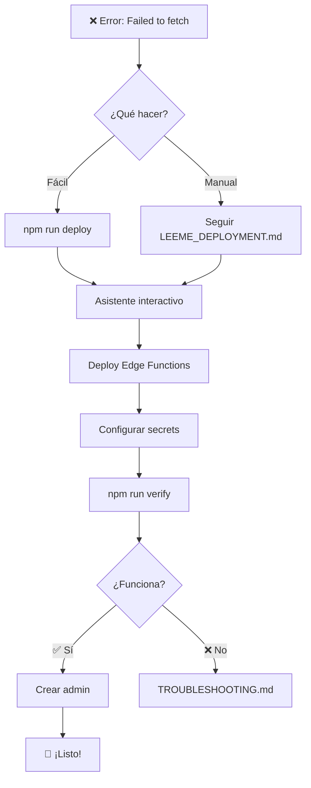

# 🏊‍♂️ Club Natación Lo Prado - Sistema de Gestión

> **Haz que todo sea posible**

## 🚨 ¿Ves este error?

```
❌ Servidor no alcanzable: TypeError: Failed to fetch
```

### ✅ Solución en 1 comando:

```bash
npm run deploy
```

Este comando ejecuta un **asistente interactivo** que te guiará paso a paso.

---

## 📚 Documentación Completa

### 🎯 Deployment (Arreglar error de servidor)

| Archivo | Descripción | Para quién |
|---------|-------------|------------|
| **`LEEME_DEPLOYMENT.md`** ⭐ | Guía completa con 3 opciones | **EMPIEZA AQUÍ** |
| `SOLUCION_RAPIDA.md` | Comandos directos | Usuarios avanzados |
| `DESPLIEGUE_PASO_A_PASO.md` | Guía detallada | Principiantes |
| `SUPABASE_DEPLOYMENT.md` | Documentación técnica | Desarrolladores |

### 📖 Guías de Usuario

| Archivo | Descripción |
|---------|-------------|
| `INICIO_RAPIDO.md` | Primeros pasos en la app |
| `INSTRUCCIONES_PRIMER_USO.md` | Configuración inicial |
| `GUIA_GESTION_ENTRENAMIENTOS_GRUPOS.md` | Gestión de entrenamientos |

### 🔧 Técnicas

| Archivo | Descripción |
|---------|-------------|
| `TROUBLESHOOTING.md` | Solución de problemas |
| `MIGRACION_SUPABASE.md` | Detalles técnicos del backend |
| `CHECKLIST.md` | Lista de verificación |

---

## ⚡ Comandos Rápidos

```bash
# 🚀 Deployment
npm run deploy          # Asistente interactivo
npm run check-server    # Verificar estado
npm run verify          # Verificación completa

# 💻 Desarrollo
npm run dev             # Iniciar app
npm run dev:clean       # Limpiar cache + iniciar
npm run build           # Compilar producción

# 🔍 Diagnóstico
supabase functions logs server      # Ver logs
supabase secrets list               # Ver configuración
```

---

## 🎯 Flujo de Deployment



---

## 📊 Estado del Sistema

### ✅ Funcionando
- ✅ Aplicación frontend (React + Tailwind)
- ✅ Código del servidor (Edge Functions)
- ✅ Base de datos (PostgreSQL en Supabase)
- ✅ Almacenamiento (Supabase Storage)
- ✅ Deploy en Vercel (producción)

### ⚠️ Requiere Configuración
- ⚠️ Edge Functions no desplegadas (requiere `npm run deploy`)
- ⚠️ Usuario administrador no creado (automático después del deploy)

---

## 🔐 Credenciales del Admin

**Después de ejecutar `npm run deploy`:**

```
Email:    admin@loprado.cl
Password: admin123
```

⚠️ **CAMBIAR CONTRASEÑA después del primer login**

---

## 🌐 URLs del Proyecto

### Producción
- **App:** https://clubnatacionloprado-bzxkjy9d9-jean-paul-vittas-projects.vercel.app/

### Supabase Dashboard
- **Dashboard:** https://supabase.com/dashboard/project/tvkrvozifmbgkaztwxib
- **Functions:** https://supabase.com/dashboard/project/tvkrvozifmbgkaztwxib/functions
- **API Keys:** https://supabase.com/dashboard/project/tvkrvozifmbgkaztwxib/settings/api

### API
- **Health:** https://tvkrvozifmbgkaztwxib.supabase.co/functions/v1/make-server-4909a0bc/health
- **Init Admin:** https://tvkrvozifmbgkaztwxib.supabase.co/functions/v1/make-server-4909a0bc/auth/init-admin

---

## 🛠️ Stack Tecnológico

### Frontend
- React 18.3.1
- Vite 6.3.5
- Tailwind CSS 4.1.12
- Radix UI
- Recharts
- Motion (Framer Motion)

### Backend
- Supabase (BaaS)
- PostgreSQL
- Edge Functions (Deno)
- Hono (Web Framework)
- Supabase Auth

### Deployment
- Frontend: Vercel
- Backend: Supabase Edge Functions

---

## 🎨 Características

### Para Administradores
- ✅ Gestión completa de usuarios (nadadores, coaches)
- ✅ Sistema de solicitudes de contraseña
- ✅ Configuración del sistema
- ✅ Acceso total a estadísticas

### Para Entrenadores (Coaches)
- ✅ Gestión de entrenamientos por grupos
- ✅ Sistema de mesociclos y planificación
- ✅ Registro de asistencia
- ✅ Gestión de competencias
- ✅ Carga de resultados y PDFs
- ✅ Estadísticas de equipo

### Para Nadadores
- ✅ Ver entrenamientos asignados
- ✅ Historial de asistencia
- ✅ Marcas personales
- ✅ Progresión en gráficos
- ✅ Competencias participadas
- ✅ Sistema de logros y medallas

### Funcionalidades Generales
- ✅ Sistema de autenticación con roles
- ✅ Modo offline con fallback a localStorage
- ✅ Gráficos de progresión (Recharts)
- ✅ Calendario integrado
- ✅ Sistema de alertas de asistencia
- ✅ Análisis avanzado de asistencia
- ✅ Gestión de días festivos
- ✅ Exportación de datos
- ✅ Responsive design

---

## 📱 Capturas

### Dashboard Principal


### Gestión de Nadadores


### Calendario de Entrenamientos


---

## 🚀 Inicio Rápido

### 1. Clonar y Setup
```bash
git clone <tu-repo>
cd <tu-proyecto>
npm install
```

### 2. Desplegar Backend
```bash
npm run deploy
```

### 3. Iniciar Aplicación
```bash
npm run dev
```

### 4. Crear Admin y Login
- Abre: http://localhost:5173
- Clic en "Crear Usuario Administrador Ahora"
- Login con: `admin@loprado.cl` / `admin123`

---

## 🆘 Necesitas Ayuda?

### 1. Ejecuta el diagnóstico
```bash
npm run verify
```

### 2. Revisa la documentación
- **Error de servidor:** `LEEME_DEPLOYMENT.md`
- **Problemas generales:** `TROUBLESHOOTING.md`
- **Índice completo:** `INDICE_DOCUMENTACION.md`

### 3. Revisa los logs
```bash
supabase functions logs server
```

---

## 📝 Changelog

### v2.0 - Migración Completa a Supabase
- ✅ Migración de datos a Supabase
- ✅ Implementación de Edge Functions
- ✅ Sistema de autenticación robusto
- ✅ Almacenamiento de PDFs en Supabase Storage
- ✅ Fallback automático a localStorage
- ✅ Nuevo branding Club Natación Lo Prado

### v1.0 - Sistema Inicial
- ✅ Sistema completo de gestión de natación
- ✅ Gestión de nadadores y entrenamientos
- ✅ Sistema de asistencia
- ✅ Competencias y resultados

---

## 📄 Licencia

Proyecto privado - Club Natación Lo Prado

---

## 👥 Créditos

Ver `ATTRIBUTIONS.md` para la lista completa de librerías y créditos.

---

**💡 ¿Primera vez?** Ejecuta `npm run deploy` y sigue las instrucciones.

**📖 ¿Necesitas más info?** Lee `INDICE_DOCUMENTACION.md` para encontrar toda la documentación.

**🚨 ¿Problemas?** Consulta `TROUBLESHOOTING.md` o ejecuta `npm run verify`.

---

<div align="center">

**Club Natación Lo Prado**

*Haz que todo sea posible* 🏊‍♂️

</div>
